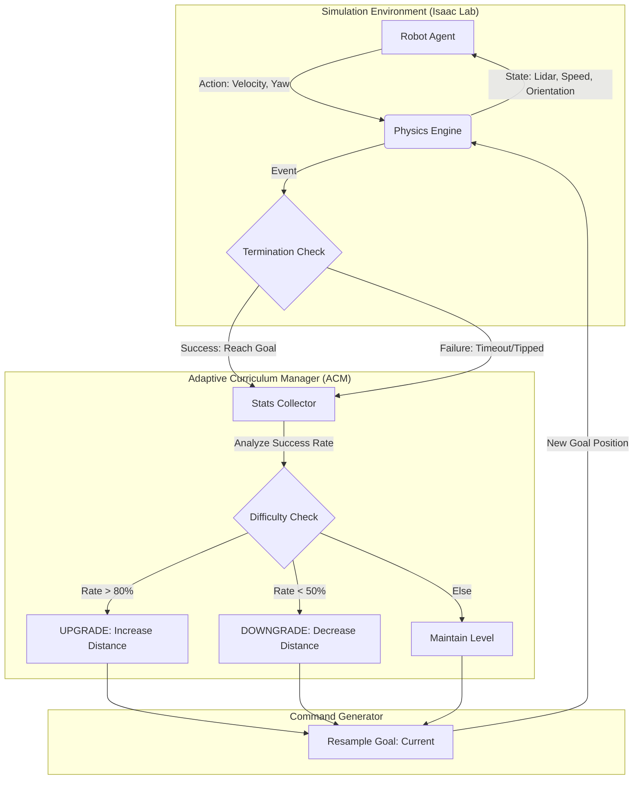

# Intelligent Agent Navigation: Phase 3 Training Architecture
## 基於自適應課程學習的強健導航訓練 (Robust Navigation via Adaptive Curriculum)

---

### Slide 1: 專案現況與 Phase 3 核心目標 (Project Overview)

**標題：Phase 3 訓練階段：強化目標導向的自適應導航**

**1. 為什麼進入 Phase 3？ (Why Phase 3?)**
*   **背景 (Context)**：在 Phase 2 (含障礙物) 訓練中，我們觀察到 Agent 出現「過度保守」行為（如蛇行、原地打轉），這是因為對碰撞的恐懼壓倒了對目標的渴望。
*   **痛點 (Pain Point)**：Agent 為了避免扣分，甚至學會了利用物理漏洞（翻車滑行）來騙取獎勵 (Reward Hacking)。
*   **解決方案 (Solution)**：回歸本質，暫時移除障礙物，執行 **「純淨目標訓練 (Pure Goal Seeking)」**。

**2. 核心目標 (Core Objectives)**
*   **建立導航意志**：讓 Agent 建立強大的「直線導航 (Ballistic Navigation)」能力。
*   **消除恐懼**：在無干擾環境下，將「抵達目標 = 高額回報」的連結刻入神經網路深層。
*   **準備未來**：為 Phase 4 (動態障礙物) 打下堅實的路徑規劃基礎。

**3. 關鍵改進 (Key Features)**
*   **環境簡化**：移除所有障礙物，僅保留 8m 邊界牆壁。
*   **自適應距離課程**：難度由 **「目標距離 (2m-15m)」** 定義，而非障礙物數量。
*   **反作弊機制**：引入 **「姿態門控 (Gated Rewards)」**，翻車即無分。

---

### Slide 2: 系統架構與自動化課程 (System Architecture)

**標題：自適應課程學習迴路 (Adaptive Curriculum Learning Loop)**

**1. 訓練流程圖 (Training Architecture)**

**2. 機制說明 (Mechanism Logic)**
*   **雙重閉環 (Dual Loop Control)**：
    *   **內環 (Inner Loop)**：PPO 策略更新 (微秒級)，優化動作輸出。
    *   **外環 (Outer Loop)**：ACM 課程管理 (Episode 級)，動態調整環境參數。
*   **自動調參 (Auto-Tuning)**：
    *   系統即時監控最近 100 次 Episode 的成功率。
    *   **升級機制**：當成功率 > 80% 時，目標距離逐漸拉長 (Max 15m)。
    *   **降級機制**：當成功率 < 50% 時，目標距離縮短，確保 Agent 不會因任務太難而「崩潰 (Collapse)」。

---

### Slide 3: 技術細節與未來展望 (Technical Approach & Roadmap)

**標題：關鍵技術實作與下一階段規劃**

**1. 獎勵函數工程 (Reward Engineering Deep Dive)**
我們重新設計了獎勵函數，專注於「有效性」與「真實性」：

| 獎勵項目 (Reward Term) | 權重 (Weight) | 設計目的 (Design Intent) |
| :--- | :--- | :--- |
| **Reaching Goal** | **+500.0** | **決定性獎勵**。給予極大值，讓 Agent 明白這是唯一目標。 |
| **Velocity to Goal** | **+3.0** | **效率獎勵**。計算速度向量在目標方向的投影，鼓勵「直直走」。 |
| **Distance Progress** | +5.0 | 引導獎勵。提供稠密 (Dense) 反饋，引導初期學習。 |
| **Tipped Over** | **-200.0** | **懲罰**。翻車立即終止並重罰。 |
| **Gated Mechanism** | (Logic) | **門控開關**。若 `Upright Check` 失敗 (翻車)，所有移動獎勵強制歸零。 |

**2. 發展藍圖 (Development Roadmap)**
*   **Phase 2.5 (Completed)**：靜態障礙物初步測試 (發現蛇行問題)。
*   **Phase 3 (Current Focus)**：**基底能力建構**。
    *   目標：在 15m 距離下達到 >90% 成功率。
    *   產出：一個「極度渴望到達目標」的強健策略網路 (Checkpoint)。
*   **Phase 4 (Next Step)**：**動態整合**。
    *   策略：Load Phase 3 Checkpoint -> 逐步加入移動障礙物。
    *   預期：Agent 將學會「在衝向目標的過程中，最小幅度地閃避障礙物」，而非一味逃跑。

---
